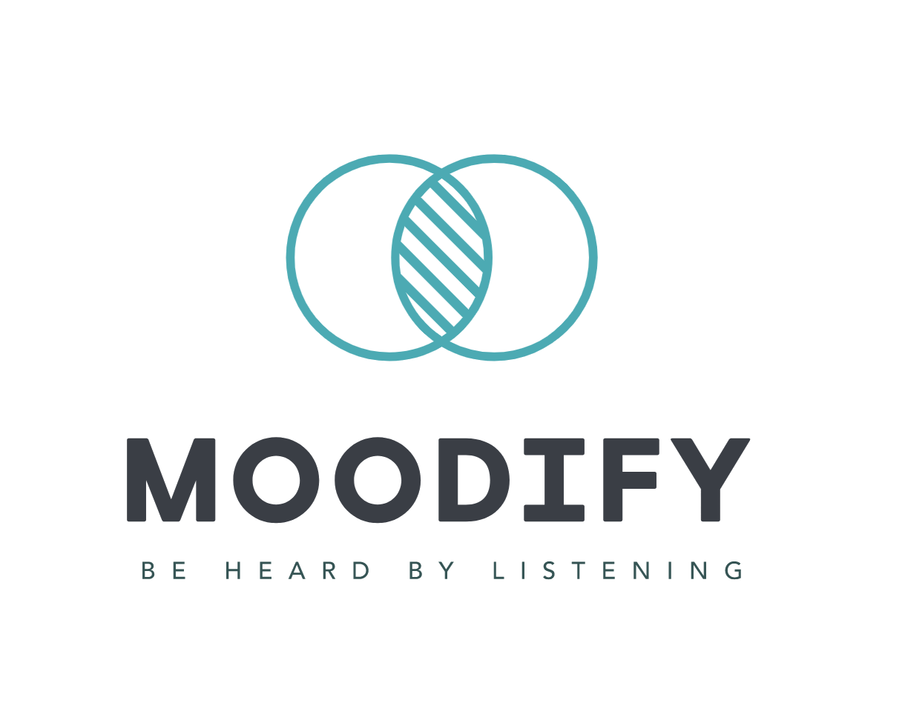

<!-- PROJECT LOGO -->
 

  

<h2 align="center">Hackzurich 2021</h2>

## Inspiration

Covid taught us once again, change is not easy and having a fully home-office setup makes work life balance challenging. Leaders experience hard times to keep people motivated and maintain their company culture. Employees struggle to boost their mood, take care of themself and manage their deliverables. We are all shape our workspace and we are part of it! Therefore we were looking to create a new tool which is not yet another Yoga app or an employee survey! 

## What it does

**BE HEARD BY LISTENING**

Moodify is an application that tracks the employees mood based on the music they are listening to. The idea behind this application is that everyday the employees get a popup request to enter a music track which they have in mind at the moment. The tracks from all the employees come together in a live radio which they can listen to after inputting their own track to it

Music has been chosen as a medium to keep the user interaction **minimal** and at the same time ensure high reliable data to track teams members mental health and motivation.

We use a machine learning model to predict the mood of a given track based on features such as danceability, loudness and tempo. Another machine learning model takes the mood history of employees and predicts how they’re mood will be in the upcoming days. This allows the application not only to monitor the mood of employees and react to observed drop patterns but also to rely on the predicted data to avoid employees feeling demotivated in near future. 

## How we built it

- Used the power of Golang fast develpoment for exposing APIs and build a backend for the service. 
- The machine learning models are core of the project that project the data and put them in the context. 
- Created two different frontend applications to enable users interacting with and visualize the data. 

## Accomplishments that we're proud of

* Creating a team of four that all of us are girls!
* Collaborating with three different nationalities. 
* Managed to have shape a Hybrid team, one member based in Brazil with 5 hours time zone difference. 
* We got out of our comfort zone and push ourselves to the limits. 

## What we learned

* Design thinking approach helps to bring creative ideas. 

## What's next for Moodify

* Integrating more analysis features based on the collected data.
* Giving employees the chance of entering what kind of action points they expect from employers when they are not feeling well.
* Transforming the web app to desktop app to even decrease more the action points required for the user.  

## Built with

- Languages: Golang, Python, Java Script 
- Frameworks: Victory
- Libraries: React, Tensorflow, Keras
- Cloud services: Microsoft Azure
- Database: PostgreSQL
- APIs: Spotify
- Trained Models: Keras, Tensorflow 
